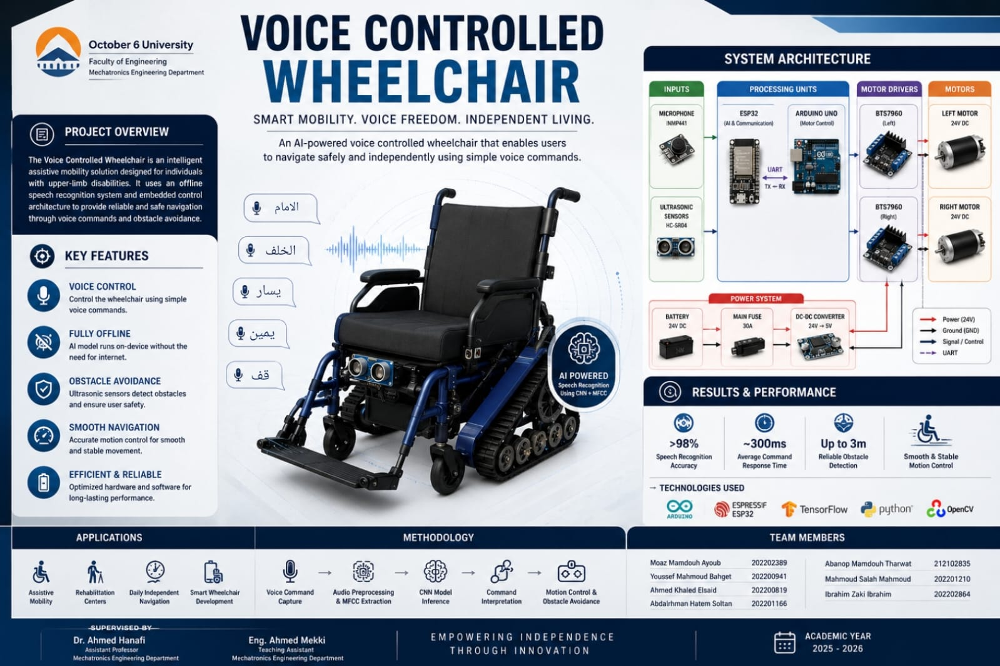
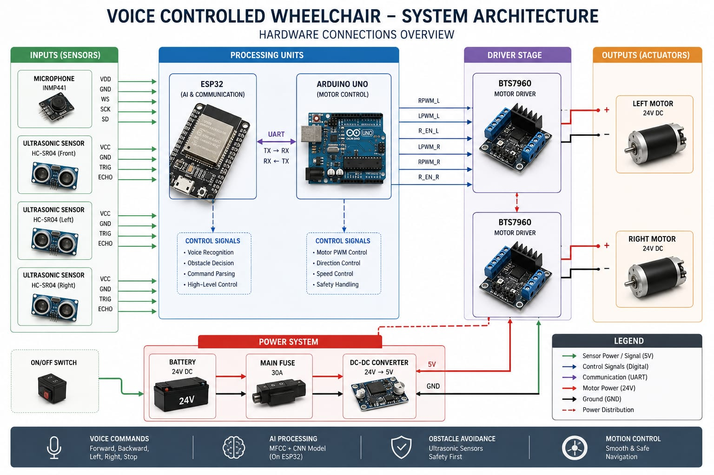

# Voice Controlled Wheelchair

<p align="center">

  

</p>

## Introduction

The **Voice Controlled Wheelchair** is an embedded AI project designed to assist users through real-time voice-based wheelchair navigation. The system combines:

- **ESP32** for audio capture and on-device AI inference
- **Arduino UNO** for motor control
- **TensorFlow Lite Micro** for speech command classification
- **MFCC feature extraction** for speech processing
- **Voice Activity Detection (VAD)** for efficient speech segmentation
- **Ultrasonic obstacle detection** for safety

The wheelchair listens for spoken commands such as:

- `forward`
- `backward`
- `left`
- `right`
- `stop`

After detecting a command, the ESP32 classifies the speech and sends movement instructions to the Arduino motor controller through UART communication.

---

# Features

- Real-time voice command recognition
- Embedded AI inference directly on ESP32
- MFCC-based audio feature extraction
- TensorFlow Lite Micro integration
- Voice Activity Detection (VAD)
- Obstacle avoidance using ultrasonic sensor
- UART communication between ESP32 and Arduino
- Lightweight and fully offline system
- Speaker enrollment and verification support

---

# System Architecture

<p align="center">
  
</p>


---

# Project Structure
<p align="center">

  

</p>

```text
Voice Controlled WheelChair/
│
├── arduino/
│   └── main.ino
│
├── check_audio/
│   ├── check.py
│   └── check_audio.ino
│
├── esp32/
│   ├── classifier.cpp
│   ├── classifier.h
│   ├── collect_mfcc.py
│   ├── main.ino
│   ├── mfcc.cpp
│   ├── mfcc.h
│   ├── mic.cpp
│   ├── mic.h
│   ├── model.h
│   ├── speaker.cpp
│   ├── speaker.h
│   ├── train.ino
│   ├── train.py
│   ├── vad.cpp
│   └── vad.h
```

---

# Hardware Components

| Component | Purpose |
|---|---|
| ESP32 | Audio processing and AI inference |
| Arduino UNO | Motor control |
| INMP441 I2S Microphone | Speech input |
| Motor Driver | Controls wheelchair motors |
| DC Motors | Wheelchair movement |
| Ultrasonic Sensor (HC-SR04) | Obstacle detection |
| Battery Pack | Power supply |

---

# Software Stack

| Technology | Usage |
|---|---|
| Arduino IDE | Firmware development |
| Python | Dataset collection and training |
| TensorFlow / Keras | Model training |
| TensorFlow Lite Micro | Embedded inference |
| ESP-DSP | FFT and DSP acceleration |
| PySerial | Serial communication |
| Pandas / NumPy | Data processing |

---

# Workflow

## 1. Audio Capture

The INMP441 microphone captures audio at:

- Sample Rate: `16 kHz`
- Mono channel
- I2S interface

---

## 2. Voice Activity Detection

The system continuously listens for speech.

Once speech energy exceeds the configured threshold, audio recording starts automatically.

When silence is detected for a specified duration, the audio window is finalized.

---

## 3. MFCC Feature Extraction

The captured speech signal is converted into MFCC features:

- FFT size: `512`
- Hop length: `160`
- Mel filters: `26`
- MFCC coefficients: `13`
- Maximum frames: `47`

These features are used as the neural network input.

---

# MFCC Pipeline

<p align="center">
  
</p>

---

## 4. AI Classification

The ESP32 runs a TensorFlow Lite Micro model that classifies commands.

The supported commands are:

```text
forward
backward
left
right
stop
noise
```

The predicted command is sent to the Arduino through UART.

---

## 5. Motor Control

The Arduino receives single-character commands:

| Command | Action |
|---|---|
| `f` | Move forward |
| `b` | Move backward |
| `l` | Turn left |
| `r` | Turn right |
| `s` | Stop |

---

## 6. Safety System

The ultrasonic sensor continuously measures distance.

If an object is detected within `30 cm`, the Arduino immediately stops the motors.

---

# Communication Diagram

```text
+-------------+        UART         +----------------+
|    ESP32    |  ---------------->  |  Arduino UNO  |
|-------------|                     |----------------|
| AI Inference|                     | Motor Control |
| Voice Input |                     | Safety Logic  |
+-------------+                     +----------------+
```

---

# Pin Configuration

## ESP32 Microphone Pins

| Signal | GPIO |
|---|---|
| WS | 15 |
| SCK | 14 |
| SD | 32 |

---

## UART Communication

| ESP32 Pin | Arduino |
|---|---|
| TX (17) | RX |
| RX (16) | TX |

---

## Ultrasonic Sensor

| Sensor Pin | Arduino Pin |
|---|---|
| TRIG | 12 |
| ECHO | 13 |

---

# Installation

## 1. Clone Repository

```bash
git clone https://github.com/your-username/voice-controlled-wheelchair.git
cd voice-controlled-wheelchair
```

---

## 2. Install Python Dependencies

```bash
pip install tensorflow pandas numpy scikit-learn pyserial
```

---

## 3. Install Arduino Libraries

Install the following libraries from Arduino Library Manager:

- TensorFlowLite_ESP32
- ESP-DSP
- SoftwareSerial

---

# Model Training

## Step 1 — Collect Dataset

Upload:

```text
esp32/train.ino
```

Then collect MFCC samples:

```bash
python collect_mfcc.py --port COM3 --label forward --count 40
```

Repeat for all labels.

Dataset structure:

```text
mfcc_data/
├── forward/
├── backward/
├── left/
├── right/
├── stop/
└── noise/
```

---

## Step 2 — Train Model

Run:

```bash
python train.py
```

This will:

- Train the neural network
- Quantize the model to INT8
- Export `model.h`

---

## Step 3 — Upload ESP32 Firmware

Upload:

```text
esp32/main.ino
```

---

## Step 4 — Upload Arduino Firmware

Upload:

```text
arduino/main.ino
```

---

# How to Use

1. Power the ESP32 and Arduino.
2. Speak a command clearly.
3. The ESP32 processes the speech.
4. The classified command is transmitted to Arduino.
5. Arduino drives the motors.
6. If an obstacle is detected, movement stops automatically.

---

# Audio Debugging

The `check_audio` folder can be used to test microphone recording.

Upload:

```text
check_audio/check_audio.ino
```

Then run:

```bash
python check.py
```

This records audio from the ESP32 and saves it as a WAV file.

---

# Speaker Verification

The project also supports optional speaker enrollment.

Commands:

| Serial Command | Action |
|---|---|
| `e` | Enroll speaker |
| `x` | Erase speaker profile |
| `m` | Record MFCC sample |

Speaker verification uses cosine similarity between MFCC vectors.

---

# AI Model Details

## Neural Network Architecture

<p align="center">
  
</p>

---

# Future Improvements

- Add wake-word detection
- Improve speaker verification
- Add speed control commands
- Mobile application integration
- Bluetooth / Wi-Fi remote monitoring
- Better obstacle avoidance using LiDAR
- Battery monitoring system

---

# Demo Flow

<p align="center">
  
</p>

---

# Notes

- The model runs fully offline.
- All inference is performed directly on the ESP32.
- The project is optimized for low-latency embedded deployment.
- MFCC extraction on-device ensures training and inference consistency.

---
